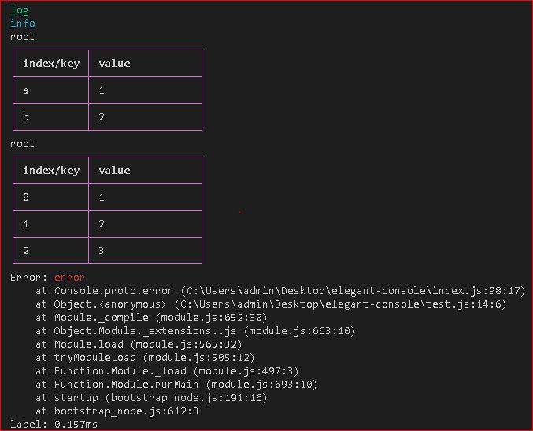

# Desciption
This is a node.js module to beatuify the console in terminal.

# Usage
## Simple
```js
const tint = require('tinting')

// log
tint.log('log')

// info
tint.info('info')

// table
tint.table({ a: 1, b: 2 })
tint.table([1, 2, 3])

// error
tint.error('error')

// and other methods of console,
// only use the original
// for example:
tint.time('label') // only call the console.time, doing nothing
tint.timeEnd('label')
```
> the result is:   


## Custom
you can initialize a new instance with custom style by calling `tint.createInstance(options)`
```js
const tint = require('tinting')
const con = tint.createInstance({
    logStyle: {
        text: ['yellow', 'bold']
    }
})
con.log('log')
// now, output a yellow and bold string when calling log
```
## options
```js
{
    logStyle: {
        text: ['green'],
        keyword: [{
            'k': ['yellow', 'bold']
        }]
    },
    // the style of info, error, global is the same as logStyle
    // If the style of the invoked method does not exist, 
    // the style of global will be applied
    tableStyle: {
        layer: 1, // the output layer
        head: ['white', 'bold'], // the head style
        border: ['bold', 'magenta'] // the border style
    }
}
// the text property is to change the style of the whole string
// the keyword property is to change the style of the keyword in string, It takes precedence over `text`
```